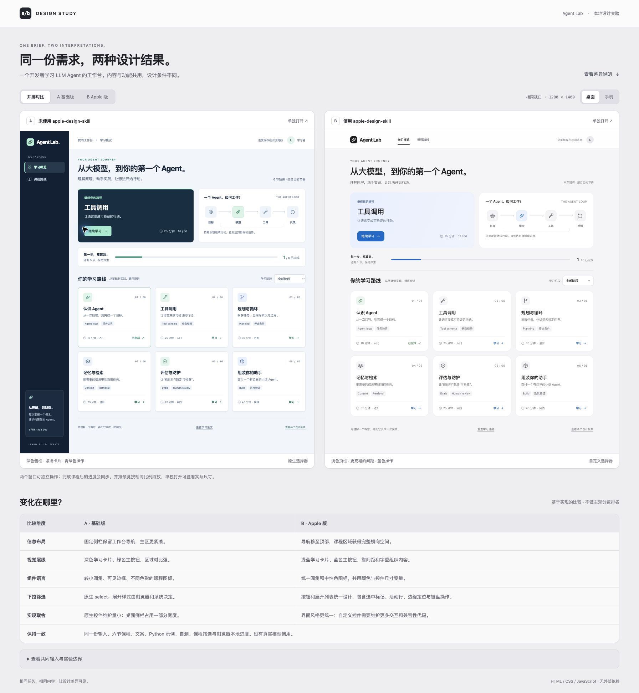

# Apple Design Skill

**让 Apple 风格贯穿整个界面，从页面布局到展开后的下拉菜单。**

为 Codex、Claude Code、Cursor 和 Agent Skills 兼容工具提供设计、实现与审查指引，重点关注视觉一致性、键盘与焦点，以及需要时的手势交互。

[](https://github.com/yqstar/apple-design-skill/actions/workflows/ci.yml)
[](https://www.npmjs.com/package/apple-design-skill)
[](LICENSE)

[快速开始](#快速开始) · [使用前后对比](#使用前后对比) · [安装与版本管理](docs/installation.md) · [参与贡献](CONTRIBUTING.md)

一条命令安装给当前用户的 Codex、Claude Code 和 Cursor，跨项目使用（Node.js 22+）：

```sh
npx apple-design-skill@latest install
```

只安装给某个工具，或安装到项目目录？见[快速开始](#快速开始)。

## 使用前后对比

同一份 Agent Lab 中文学习页需求，同样的六节课程、Python 示例、自测与本机进度。左侧为未读取 Skill 完整指令的基础版，右侧为读取后的 Apple 版。

[](examples/agent-learning-compare/screenshots/comparison-desktop.jpg)

| 维度 | 未使用 Skill · A | 使用 Skill · B |
| --- | --- | --- |
| 导航与布局 | 深色侧栏，主区域紧凑 | 浅色顶部导航，更充裕的内容间距 |
| 视觉层级 | 深色学习卡片、青绿色主按钮 | 浅蓝学习卡片、蓝色主按钮 |
| 组件一致性 | 小圆角、可见边框、彩色课程图标 | 统一视觉变量、卡片圆角与中性色图标 |
| 下拉菜单 | 原生 `select`，展开外观由系统决定 | 自定义 combobox，触发器和展开列表统一设计 |
| 实现取舍 | 原生控件的维护成本较低 | 完整控制菜单外观，同时需要维护键盘、定位和焦点逻辑 |

更多效果：[手机对照](examples/agent-learning-compare/screenshots/comparison-mobile.jpg) · [展开菜单](examples/agent-learning-compare/screenshots/apple-menu-desktop.jpg)。

这是同一实现者顺序完成的设计对照，仅展示本次实现差异。[查看示例说明](examples/agent-learning-compare/README.md)。

克隆仓库后，在仓库根目录运行即可亲自操作两版页面，无构建步骤、无模型调用：

```sh
python3 -m http.server 4177 --bind 127.0.0.1 --directory examples/agent-learning-compare/dist
```

打开 <http://127.0.0.1:4177/index.html>，可切换并排、单版、桌面和手机预览。示例随 Git 仓库提供。

## 快速开始

需要 **Node.js 22+**。默认安装到用户目录，可在任意目录执行：

```sh
# 默认：用户级安装，供 Codex、Claude Code、Cursor 使用
npx apple-design-skill@latest install

# 只安装给指定工具
npx apple-design-skill@latest install --agent codex
npx apple-design-skill@latest install --agent claude
npx apple-design-skill@latest install --agent cursor

# 仅安装到当前项目
npx apple-design-skill@latest install --project

# 安装到指定项目，也可同时选择工具
npx apple-design-skill@latest install --project ./my-project --agent codex
```

默认目标为 `~/.agents/skills`（Codex）、`~/.claude/skills`（Claude Code）、`~/.cursor/skills`（Cursor）中的 `apple-design-skill`。`--global` 和 `--all` 可显式声明默认行为；`--agent` 限定工具，`--project [路径]` 切换到项目目录。先查看目标路径可追加 `--dry-run`。npm 下载本包不会自动写入技能目录，`install` 命令才会执行安装。

安装后，在新会话中给出具体任务：

```text
使用 apple-design-skill 改进这个页面。
保留现有需求和技术栈，统一布局、排版与组件状态。
特别检查下拉按钮与展开菜单，并验证键盘选择、关闭方式和窄屏布局。
```

Codex 可显式调用 `$apple-design-skill`，Claude Code 可调用 `/apple-design-skill`。固定版本、项目级安装、重复入口、升级与回退见[安装指南](docs/installation.md)。

## 适合哪些任务

| 任务 | Skill 关注的结果 |
| --- | --- |
| 制作或改进 Web 界面 | 遵循现有设计系统，统一排版、颜色、间距、圆角及组件状态 |
| 修复下拉菜单风格不一致 | 同时检查按钮和展开面板，以及选中、活动、禁用和定位状态 |
| 审查界面与交互 | 给出问题位置、触发条件、影响和可验证的修正建议 |
| 实现拖拽、滑动或弹簧动效 | 直接跟手、速度衔接、可中断动画与正确的最终状态 |

技能正文见 [SKILL.md](skills/apple-design-skill/SKILL.md)。普通静态布局无需引入手势实现；玻璃、模糊和弹跳都是可选设计手段。

这是基于 Apple 设计资料的 Web 实践指南，不是 Apple 官方规范或官方产品。技能提供工作指引，无运行时依赖；使用宿主工具现有的模型与权限，不附带模型服务或 API。

## 项目组织

```text
skills/apple-design-skill/     # 唯一的可安装技能源与宿主元数据
bin/                          # npm CLI 入口
lib/                          # 安装、版本缓存、回退与卸载
examples/agent-learning-compare/
  dist/                       # 可直接运行的 A/B 页面与共用资源
  screenshots/                # 桌面、手机与展开菜单的最终截图
docs/                         # 安装、发布与项目组织参考
scripts/                      # 校验与版本维护
tests/                        # 安装器及 npm 包测试
.github/workflows/            # 跨平台 CI 与 npm 发布
.codex-plugin/                # Codex 插件清单
.claude-plugin/               # Claude Code 插件清单
```

技能源与安装器分别维护；展示页面和截图留在 `examples/`，不进入 npm 安装包或宿主技能目录。插件清单供兼容宿主使用，npm CLI 直接安装 Skill，不自动注册插件市场。

## 开发与贡献

```sh
npm ci --ignore-scripts
npm run check
npm run check:example
npm test
npm pack --dry-run
```

欢迎提供可复现的设计问题、交互缺陷与文档改进。[贡献指南](CONTRIBUTING.md)说明修改位置及验证要求；[发布指南](docs/releasing.md)说明版本同步和 GitHub Actions → npm 流程；[项目组织参考](docs/project-references.md)记录本次参考的高星 Skill 仓库及采用的做法。

## 来源与许可证

[MIT](LICENSE) · Copyright 2026 yqstar。设计指导引用的 Apple、W3C、MDN 等资料见 [SKILL.md 的 Sources](skills/apple-design-skill/SKILL.md#sources)，第三方资料的权利仍属于原权利人。
